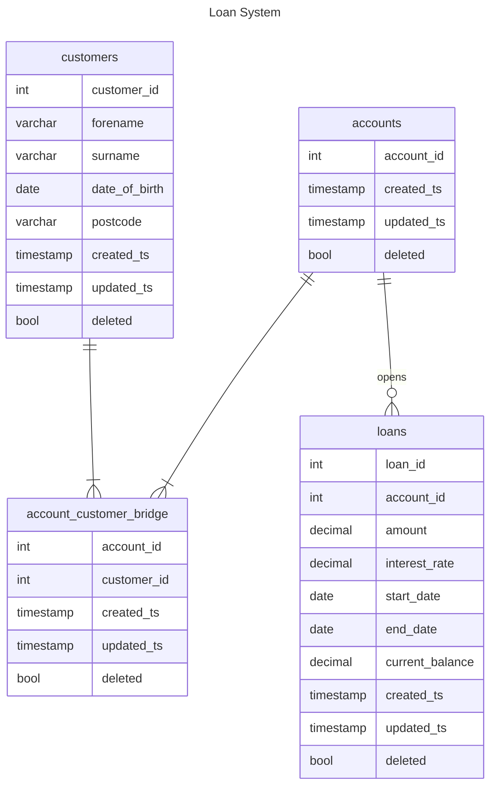

---

# Database CRUD Example

A simple example of a CRUD implementation for a database layer.

## Model

The model is loan system with accounts, customers, loans, and links between the accounts and customers ("account-customer bridges") since accounts can have multiple customers and customers can have multiple accounts.

